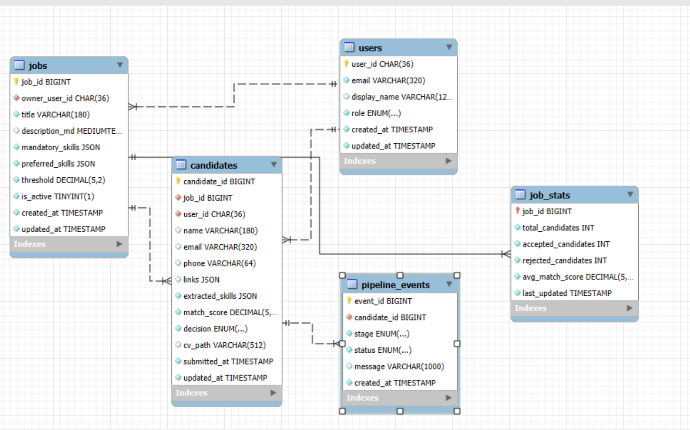

# 🧠 CV Screening & Candidate Filtering System

An **AI-powered resume screening platform** that automates the first stage of recruitment — extracting, evaluating, and ranking candidate CVs with speed and precision.  
Designed for **HR teams** to handle high-volume hiring efficiently, consistently, and at scale.

---

## 📋 Overview

The **CV Screening and Candidate Filtering System** enables recruiters to:

- 📄 Upload **job descriptions** and **batches of candidate CVs** (PDF).  
- 🧠 Automatically **extract key candidate information** (skills, contact details, etc.).  
- ⚖️ Compare candidate profiles against role requirements using a **deterministic scoring model**.  
- 🟢🔸🔴 Generate a **quantitative match score** and preliminary **Accept / Review / Reject** decision.  

This removes repetitive manual screening and ensures **standardized, fair, and explainable** candidate evaluations.

---

## 🎯 Project Goals

- 🚀 **Automate resume screening**  
  Parse and structure diverse CV formats to reduce manual work.

- ⚖️ **Standardize candidate evaluation**  
  Use a transparent scoring model for fairness and consistency.

- 📈 **Scale with volume**  
  Handle **50+ CVs** in a single batch reliably.

- 🧭 **Support HR decision-making**  
  Provide clear breakdowns of **matched vs. missing skills**.

---

## 🏗️ Features

### 📝 Job Management
- Create new job roles by providing a **title** and **full job description**.  
- System auto-extracts **Mandatory** and **Preferred** skills.  
- View or delete active jobs and their candidate records.

### 📥 Candidate Input
- Upload **multiple CVs (PDF)** for a selected job.  
- Instant processing and extraction.

### 🧾 Data Extraction
- Extracts:  
  - ✅ Full Name  
  - 📧 Email Address  
  - 📞 Phone Number  
  - 🌐 Professional Links (LinkedIn, GitHub, Portfolio)  
  - 🛠 Extracted Skills  
- Uses **PDF.js**, **RegEx**, and NLP heuristics.

### 🧮 Candidate Evaluation
- Custom **scoring methodology** compares candidate skills with job requirements using weighted metrics.  
- Generates a **match score** and preliminary decision.

### 📊 Results Management
- Real-time updates when new CVs are added.  
- Filter and view candidates by job, score, and status with clear visualization.

---

## 🧰 Tech Stack

| Component           | Technology                                    | Rationale |
|----------------------|-----------------------------------------------|-----------|
| 🖼 Frontend          | HTML5, Tailwind CSS, TypeScript (ES6+)        | Lightweight, responsive UI |
| 📄 Data Extraction   | PDF.js, RegEx, heuristic parsing              | Fast, client-side OCR/NLP simulation |
| 🗃 Database          | SQL (SQLite / PostgreSQL)                     | Structured storage for analytics |
| 🔐 Authentication   | Subbase (Custom/Anonymous)                   | Secure, user-scoped access |

---

## 🧭 Database ERD Diagram

The following **Entity–Relationship Diagram (ERD)** illustrates the structure and relationships between core tables in the CV Screening & Candidate Filtering System.



---

## 🧱 Database Schema

### `Jobs` Table  
Stores job criteria and definitions.

| Field               | Type       | Description                    |
|----------------------|-----------|--------------------------------|
| job_id (PK)         | INTEGER   | Unique Job ID                  |
| user_id            | TEXT      | Owner/HR identifier            |
| title              | TEXT      | Job Title                      |
| mandatory_skills   | JSON      | Required skills list           |
| preferred_skills   | JSON      | Nice-to-have skills list       |
| created_at         | TIMESTAMP | Creation time                  |

### `Candidates` Table  
Stores candidate data and evaluation results.

| Field               | Type       | Description                    |
|----------------------|-----------|--------------------------------|
| candidate_id (PK)   | INTEGER   | Unique Candidate ID            |
| job_id (FK)        | INTEGER   | Associated Job ID              |
| name               | TEXT      | Candidate Name                 |
| email              | TEXT      | Contact Email                  |
| phone              | TEXT      | Contact Number                 |
| extracted_skills   | JSON      | Parsed skills                  |
| match_score        | REAL      | Computed score (0-100)        |
| decision           | TEXT      | Accept / Review / Reject       |
| submitted_at       | TIMESTAMP | CV submission time            |

---

## 🧪 Testing & Validation

| Test Area             | Criteria for Success | Purpose |
|-------------------------|-----------------------|---------|
| 📑 **Extraction**        | ≥ 95% accuracy for name, email, phone, links | Robust RegEx/NLP |
| 🧮 **Scoring Accuracy**  | 100% match to weighted criteria | Verify business logic |
| ✅ **Decision Logic**    | Perfect threshold adherence | HR requirements |
| ⚡ **System Stability** | Batch of 50+ CVs processed without failure | Scalability & error handling |

---

## 🧭 Architecture Highlights

- 🧩 **Modular Design** — OCR, Scoring Engine, and Database are loosely coupled for easy maintenance.  
- 📊 **Scalable & Stable** — Handles high loads without downtime.  
- 🌐 **Responsive UI** — Simple, modern single-file web app.  
- 🧠 **Transparent Evaluation** — Explainable scoring for better HR trust.

---

## 📌 Future Enhancements

- 🤖 Integrate actual NLP models for semantic skill matching.  
- 📨 Email notifications to candidates.  
- 📊 Dashboard analytics for HR insights.  
- ☁️ Cloud deployment & CI/CD pipeline.

---

## 🚀 Getting Started

```bash
# 1️⃣ Clone the repo
git clone https://github.com/yourusername/cv-screening-system.git

# 2️⃣ Install dependencies (if any)
cd cv-screening-system
# e.g., npm install

# 3️⃣ Run locally
# Open index.html in your browser or use a local dev server


